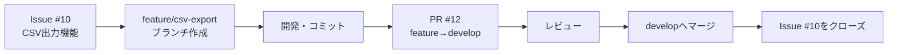
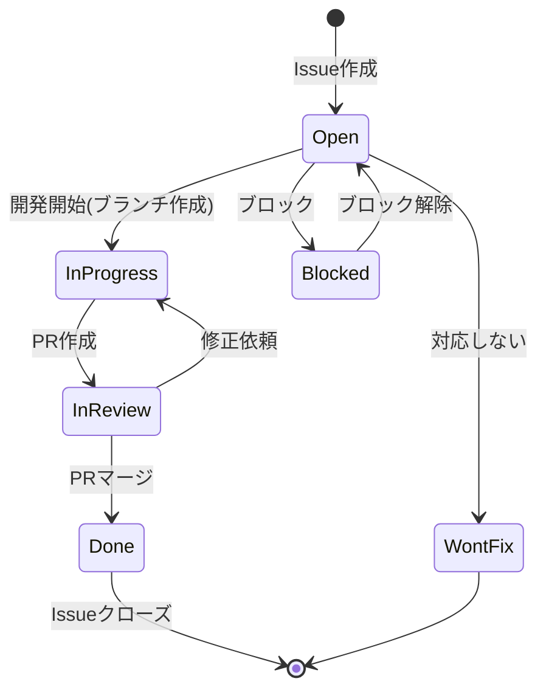

# リリース管理ガイド

## 概要

リリース管理は**ブランチ**、**Issue**、**Milestone**、**Pull Request**を組み合わせて行います。

```
┌─────────────────────────────────────────────────────┐
│              リリース管理の構成要素                 │
├─────────────────────────────────────────────────────┤
│ Milestone    → リリースの計画・スコープ管理        │
│ Issue        → 個別タスク・機能・バグの管理         │
│ Branch       → コードの実装                         │
│ Pull Request → レビュー・統合                       │
│ Release      → 本番デプロイ・リリースノート         │
└─────────────────────────────────────────────────────┘
```

---

## ブランチの作成タイミング

### ✅ すぐにブランチを作成するケース

```bash
# developブランチはプロジェクト初期に作成
git checkout -b develop
git push -u origin develop

# feature/fixブランチは開発開始時に作成
git checkout -b feature/user-authentication
git push -u origin feature/user-authentication
```

**タイミング:**
- `develop` → **今すぐ作成**（プロジェクト初期の1回のみ）
- `feature/*` → 開発着手時（Issueアサイン時）
- `fix/*` → バグ修正着手時
- `hotfix/*` → 本番の緊急時

---

## リリース管理フロー

### フェーズ1: リリース計画（Milestone作成）

**GitHub上で実施:**

1. **Milestoneを作成**
   - Settings → Milestones → New milestone
   - タイトル: `v1.2.0`
   - 期限: `2024-01-31`
   - 説明: リリースの概要

```markdown
## v1.2.0 - 勤怠管理機能の強化

### 主な機能
- CSV出力機能
- 日付フィルター機能
- レポート機能

### 目標
- リリース日: 2024-01-31
- テスト完了: 2024-01-28
```

---

### フェーズ2: 機能・バグをIssueで管理

**各機能・バグをIssueとして作成:**

#### Issue例: 新機能

```markdown
Title: [Feature] CSV出力機能の実装

## 概要
勤怠データをCSV形式でエクスポートできる機能を追加する

## 要件
- [ ] 出力ボタンの追加
- [ ] CSV生成ロジックの実装
- [ ] 日付範囲の指定機能
- [ ] テストの作成

## 受け入れ基準
- ユーザーが指定した期間の勤怠データをCSVでダウンロードできる
- エンコーディングはUTF-8
- テストカバレッジ80%以上

Labels: feature, v1.2.0
Milestone: v1.2.0
Assignees: @developer1
```

#### Issue例: バグ修正

```markdown
Title: [Bug] タイムゾーンが正しく表示されない

## 現象
勤怠データの時刻がJSTではなくUTCで表示されている

## 再現手順
1. 勤怠一覧を開く
2. 打刻時刻を確認

## 期待する動作
JSTで表示される

## 環境
- ブラウザ: Chrome 120
- OS: Windows 11

Labels: bug, priority-high, v1.2.0
Milestone: v1.2.0
```

---

### フェーズ3: 開発（Branch + PR）



**実際のコマンド:**

```bash
# 1. Issueを確認（例: Issue #10）
# 2. ブランチ作成（Issueに紐づく）
git checkout develop
git pull origin develop
git checkout -b feature/csv-export

# 3. 開発
# ... コーディング ...

# 4. コミット（Issueに言及）
git add .
git commit -m "feat: add CSV export functionality

- Implement export button
- Add CSV generation logic
- Add date range filter

Refs #10"

# 5. プッシュ
git push origin feature/csv-export

# 6. GitHub上でPR作成
# Title: feat: CSV出力機能の実装
# Body:
#   Closes #10
#
#   ## 変更内容
#   - CSV出力ボタンの追加
#   - ...
```

---

### フェーズ4: リリース準備（Issue作成）

**リリース前にリリース準備Issueを作成:**

```markdown
Title: [Release] v1.2.0 リリース準備

## リリース内容
- #10 CSV出力機能
- #11 日付フィルター機能
- #15 タイムゾーンバグ修正

## リリース前チェックリスト

### テスト
- [ ] すべてのユニットテストが通過
- [ ] E2Eテストが通過
- [ ] develop環境で動作確認完了
- [ ] パフォーマンステスト完了

### ドキュメント
- [ ] CHANGELOG.mdの更新
- [ ] ユーザーマニュアルの更新
- [ ] APIドキュメントの更新（該当する場合）

### レビュー
- [ ] コードレビュー完了
- [ ] セキュリティレビュー完了
- [ ] デザインレビュー完了（UI変更がある場合）

### デプロイ準備
- [ ] 環境変数の確認
- [ ] データベースマイグレーション確認
- [ ] ロールバック手順の確認

## リリーススケジュール
- 2024-01-28: テスト完了
- 2024-01-30: ステージング確認
- 2024-01-31: 本番リリース

## リリース後タスク
- [ ] 本番環境の動作確認
- [ ] モニタリング確認
- [ ] リリースノートの公開
- [ ] Slackで周知

Labels: release, v1.2.0
Milestone: v1.2.0
Assignees: @release-manager
```

---

### フェーズ5: リリース実行（PR + Release）

#### Step 1: develop → main のPR作成

**GitHub上でPR作成:**

```markdown
Title: Release v1.2.0

## 📦 リリース概要
v1.2.0のリリースPRです。

## ✨ 新機能
- CSV出力機能 (#10)
- 日付フィルター機能 (#11)

## 🐛 バグ修正
- タイムゾーン表示の修正 (#15)

## ✅ リリース前チェック
- [x] すべてのテスト通過
- [x] develop環境で動作確認完了
- [x] ドキュメント更新完了
- [x] セキュリティレビュー完了

## 📝 Closes
Closes #20 (リリース準備Issue)

## 📌 Milestone
v1.2.0

---
**レビュアー:** @team-lead, @senior-dev
**マージ後:** 自動的にGitHub Pagesへデプロイ
```

#### Step 2: マージ後にGitHub Releaseを作成

**GitHub上で実施:**

1. Releases → Draft a new release
2. Tag: `v1.2.0`
3. Target: `main`
4. Title: `v1.2.0 - 勤怠管理機能の強化`
5. Description:

```markdown
## 🎉 v1.2.0 リリース (2024-01-31)

### ✨ 新機能
- **CSV出力機能** (#10)
  - 勤怠データをCSV形式でエクスポート可能に
  - 日付範囲を指定してダウンロード
- **日付フィルター機能** (#11)
  - 勤怠一覧を期間で絞り込み可能に

### 🐛 バグ修正
- タイムゾーンの表示がJSTで正しく表示されるように修正 (#15)

### 🔧 改善
- パフォーマンスの最適化
- UIの微調整

### 📚 ドキュメント
- ユーザーマニュアルにCSV出力の手順を追加

### ⚠️ 破壊的変更
なし

### 🙏 貢献者
@developer1, @developer2, @designer1

---

**Full Changelog**: https://github.com/YOUR_USERNAME/attendance-tracker/compare/v1.1.0...v1.2.0
```

---

## Issue管理のベストプラクティス

### 1. Issueテンプレートの活用

#### 機能リクエスト用

`.github/ISSUE_TEMPLATE/feature_request.md`:

```markdown
---
name: 機能リクエスト
about: 新機能の提案
title: '[Feature] '
labels: 'feature'
assignees: ''
---

## 機能の概要
<!-- 何を実現したいか簡潔に説明 -->

## 背景・目的
<!-- なぜこの機能が必要か -->

## 要件
<!-- 具体的な要件をリスト化 -->
- [ ] 要件1
- [ ] 要件2

## 受け入れ基準
<!-- 完了の定義 -->

## 参考
<!-- スクリーンショット、参考URLなど -->
```

#### バグレポート用

`.github/ISSUE_TEMPLATE/bug_report.md`:

```markdown
---
name: バグレポート
about: バグの報告
title: '[Bug] '
labels: 'bug'
assignees: ''
---

## 現象
<!-- 何が起きているか -->

## 再現手順
1.
2.
3.

## 期待する動作
<!-- 本来どうあるべきか -->

## 実際の動作
<!-- 実際に何が起きたか -->

## 環境
- ブラウザ:
- OS:
- バージョン:

## スクリーンショット
<!-- あれば添付 -->
```

---

### 2. ラベルの活用

推奨ラベル:

| ラベル | 説明 | 色 |
|--------|------|-----|
| `feature` | 新機能 | 🟦 Blue |
| `bug` | バグ | 🟥 Red |
| `enhancement` | 改善 | 🟩 Green |
| `documentation` | ドキュメント | 📘 Light Blue |
| `priority-high` | 優先度高 | 🔴 Dark Red |
| `priority-medium` | 優先度中 | 🟠 Orange |
| `priority-low` | 優先度低 | 🟡 Yellow |
| `good first issue` | 初心者向け | 🟣 Purple |
| `help wanted` | ヘルプ募集 | 🆘 Pink |
| `blocked` | ブロック中 | ⚫ Black |
| `wontfix` | 対応しない | ⚪ White |

---

### 3. Issueの命名規則

```
[タイプ] 簡潔な説明

例:
[Feature] CSV出力機能の実装
[Bug] ログイン時にエラーが発生する
[Enhancement] ボタンのデザイン改善
[Docs] READMEの更新
[Release] v1.2.0 リリース準備
```

---

## リリースサイクル例

### 2週間スプリント

```
Week 1:
  Mon: Sprint計画、Milestone作成、Issue作成
  Tue-Fri: 開発 (feature→develop PR)

Week 2:
  Mon-Wed: 開発継続、バグ修正
  Thu: develop環境でテスト
  Fri: リリース (develop→main PR)
       GitHub Release作成
       Milestoneクローズ
```

### Issueのライフサイクル



---

## GitHub Projects（カンバン）との連携

オプションで、GitHub Projectsを使うとさらに管理しやすくなります:

```
┌─────────────┬─────────────┬─────────────┬─────────────┐
│   Backlog   │  To Do      │ In Progress │    Done     │
├─────────────┼─────────────┼─────────────┼─────────────┤
│ Issue #25   │ Issue #10   │ Issue #11   │ Issue #8    │
│ Issue #26   │ Issue #15   │ Issue #12   │ Issue #9    │
│             │             │             │             │
└─────────────┴─────────────┴─────────────┴─────────────┘

Milestone: v1.2.0
```

**設定方法:**
1. Projects → New project → Board
2. Issueをドラッグ&ドロップで移動
3. Automation設定（PR作成時に自動移動など）

---

## まとめ: ブランチとIssueの関係

```
Milestone v1.2.0
├── Issue #10 [Feature] CSV出力
│   └── feature/csv-export (branch)
│       └── PR #12 → develop
│
├── Issue #11 [Feature] 日付フィルター
│   └── feature/date-filter (branch)
│       └── PR #13 → develop
│
├── Issue #15 [Bug] タイムゾーン
│   └── fix/timezone-bug (branch)
│       └── PR #16 → develop
│
└── Issue #20 [Release] v1.2.0準備
    └── PR #25 → main (Release)
        └── GitHub Release v1.2.0
```

**運用のポイント:**
- ✅ ブランチは開発着手時に作成（すぐに）
- ✅ リリース管理はIssue + Milestone + GitHub Releaseで
- ✅ すべてのPRはIssueに紐づける（`Closes #XX`）
- ✅ リリース時はGitHub Releaseで正式記録

---

## 参考リンク
- [GitHub Issues](https://docs.github.com/en/issues)
- [GitHub Milestones](https://docs.github.com/en/issues/using-labels-and-milestones-to-track-work/about-milestones)
- [GitHub Releases](https://docs.github.com/en/repositories/releasing-projects-on-github)
