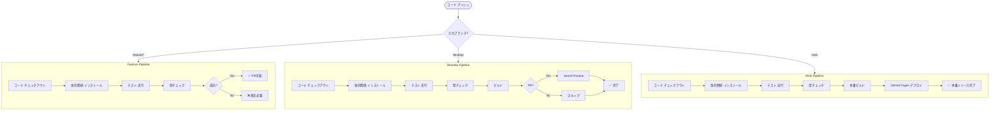

# ワークフロー図解

## 📊 ブランチとPRの全体像


---

## 🔄 通常の開発フロー（Feature開発）


---

## 🚀 リリースフロー（develop → main）


---

## 🔥 緊急修正フロー（Hotfix）


---

## 📋 PRの作成パターン一覧

### パターン1: feature → develop

```
┌─────────────────────────────────────────────┐
│ Pull Request #10                            │
├─────────────────────────────────────────────┤
│ Title: feat: CSV出力機能の追加              │
│                                             │
│ Base: develop                               │
│ ←                                           │
│ Compare: feature/csv-export                 │
│                                             │
│ Labels: feature, needs-review               │
│ Reviewers: @teammate1, @teammate2           │
│                                             │
│ ✅ Tests passed                             │
│ ✅ Type check passed                        │
│ 🚀 Vercel Preview: preview-pr10.vercel.app │
└─────────────────────────────────────────────┘
```

### パターン2: develop → main（リリース）

```
┌─────────────────────────────────────────────┐
│ Pull Request #15                            │
├─────────────────────────────────────────────┤
│ Title: Release v1.2.0 - 新機能とバグ修正   │
│                                             │
│ Base: main                                  │
│ ←                                           │
│ Compare: develop                            │
│                                             │
│ Labels: release, needs-approval             │
│ Reviewers: @team-lead, @senior-dev          │
│ Assignees: @release-manager                 │
│                                             │
│ 📦 含まれる変更:                            │
│   - CSV出力機能 (#10)                       │
│   - 日付フィルター (#11)                     │
│   - タイムゾーンバグ修正 (#12)              │
│                                             │
│ ✅ Tests passed                             │
│ ✅ Type check passed                        │
│ ✅ Build successful                         │
│ ⚠️ Requires 1 approval                      │
└─────────────────────────────────────────────┘
```

### パターン3: hotfix → main + develop

```
┌─────────────────────────────────────────────┐
│ Pull Request #20 (main用)                   │
├─────────────────────────────────────────────┤
│ Title: hotfix: セキュリティ脆弱性の修正     │
│                                             │
│ Base: main                                  │
│ ←                                           │
│ Compare: hotfix/security-fix                │
│                                             │
│ Labels: hotfix, critical, security          │
│ Priority: 🔴 URGENT                         │
│ Reviewers: @team-lead                       │
│                                             │
│ ✅ Tests passed                             │
│ ✅ Security scan passed                     │
└─────────────────────────────────────────────┘

┌─────────────────────────────────────────────┐
│ Pull Request #21 (develop用)                │
├─────────────────────────────────────────────┤
│ Title: hotfix: セキュリティ脆弱性の修正     │
│ (mainへの修正を同期)                        │
│                                             │
│ Base: develop                               │
│ ←                                           │
│ Compare: hotfix/security-fix                │
│                                             │
│ ✅ Tests passed                             │
└─────────────────────────────────────────────┘
```

---

## 🎯 ブランチの関係図

```
┌────────────────────────────────────────────────────┐
│                    ブランチ階層                    │
└────────────────────────────────────────────────────┘

main (本番)
  │
  ├─ デプロイ先: GitHub Pages
  ├─ 保護: 強（PR必須、レビュー必須、テスト必須）
  └─ マージ元: develop, hotfix/*

develop (開発)
  │
  ├─ デプロイ先: Vercel Preview
  ├─ 保護: 中（テスト必須）
  ├─ マージ元: feature/*, fix/*, hotfix/*
  │
  ├─ feature/user-authentication
  │   └─ 目的: 新機能開発
  │
  ├─ feature/csv-export
  │   └─ 目的: 新機能開発
  │
  ├─ fix/timezone-bug
  │   └─ 目的: バグ修正
  │
  └─ fix/ui-alignment
      └─ 目的: バグ修正

hotfix/* (緊急修正)
  │
  ├─ 起点: main
  ├─ マージ先: main + develop
  │
  └─ hotfix/critical-security
      └─ 目的: 本番の緊急修正
```

---

## 📅 週次の開発サイクル例


---

## 🔍 CI/CDパイプライン詳細



---

## 📊 ブランチ戦略の意思決定フロー


---

## 💡 チーム規模別の推奨運用

### 小規模チーム（1-3人）

```
main ──────●────────●──────> (本番)
           │        │
  feature/A●        │
                    │
         feature/B──●

推奨:
- developブランチは省略可
- feature/* から直接 main へPR
- こまめなリリース
```

### 中規模チーム（4-10人）

```
main ──────────────●──────> (本番)
                   │
                   │ PR (週1回)
                   │
develop ───●───●───●───●──> (開発)
           │   │   │
feature/A──●   │   │
          fix/B●   │
              feature/C●

推奨:
- developブランチ必須
- 週1回の定期リリース
- feature → develop → main
```

### 大規模チーム（10人以上）

```
main ───────────────●──────> (本番)
                    │
                    │ PR (2週間)
                    │
develop ────●───────●──────> (開発・統合)
            │
            │ PR (毎日)
            │
feature-team ●──────●──────> (チーム統合)
             │      │
  feature/A──●      │
      feature/B─────●

推奨:
- チーム別の統合ブランチ
- 2週間スプリント
- feature → feature-team → develop → main
```

---

## 📈 成功指標（KPI）

```
┌─────────────────────────────────────────┐
│ 健全な開発プロセスの指標                │
├─────────────────────────────────────────┤
│ ✅ PR作成から3時間以内に初回レビュー    │
│ ✅ PRのサイズは300行以下                │
│ ✅ PRのライフサイクルは2日以内          │
│ ✅ CI/CDパイプライン成功率 95%以上      │
│ ✅ mainブランチは常にデプロイ可能       │
│ ✅ 週に1回以上の本番リリース            │
│ ✅ hotfixの発生率は月1回以下            │
└─────────────────────────────────────────┘
```

---

## 🎓 まとめ

このワークフロー図解を参考に、チームの規模や開発速度に合わせてブランチ戦略を調整してください。

重要なポイント:
1. **小さく、頻繁にマージ** - コンフリクトを最小化
2. **自動化を最大限活用** - CI/CDで品質保証
3. **レビュー文化の醸成** - コードの品質向上
4. **ドキュメント化** - チーム全員が理解できる運用

詳細は以下のドキュメントを参照:
- [ブランチ戦略詳細](BRANCH_STRATEGY.md)
- [セットアップガイド](SETUP_GUIDE.md)
