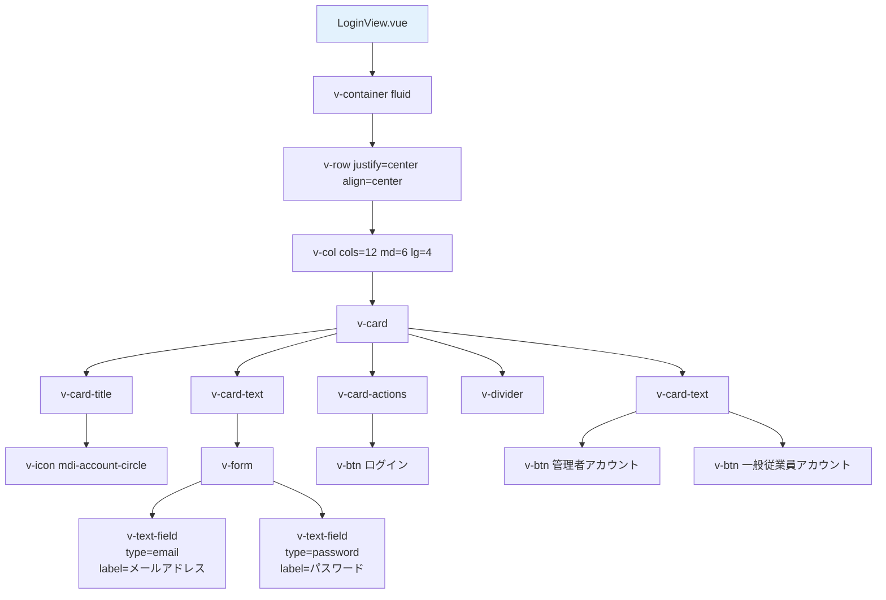
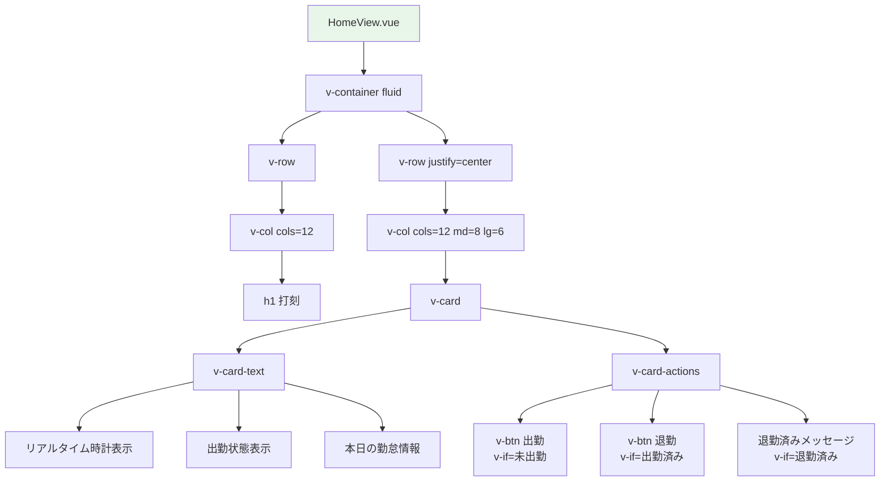
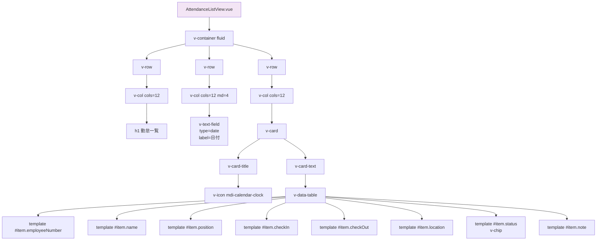
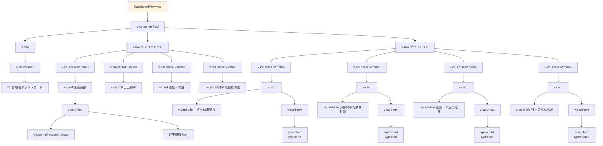
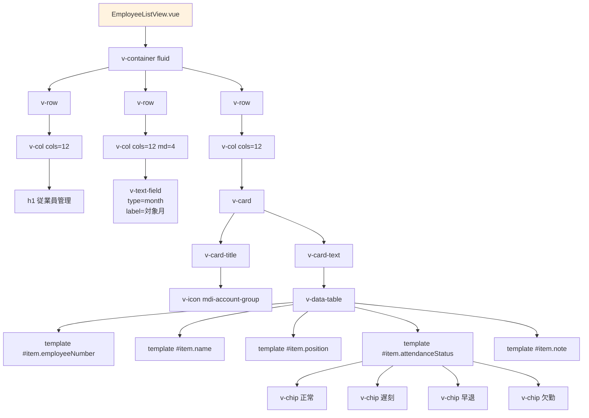
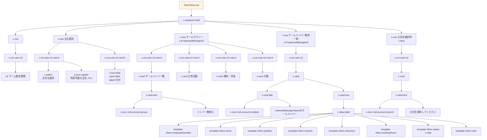
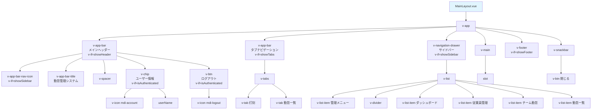
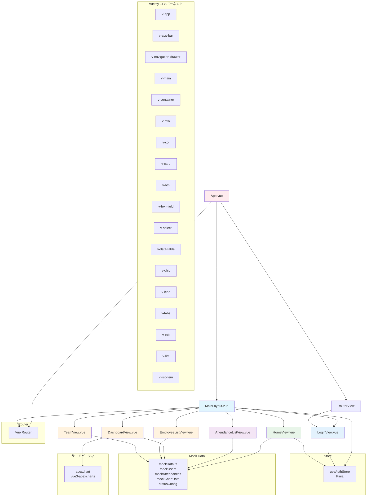
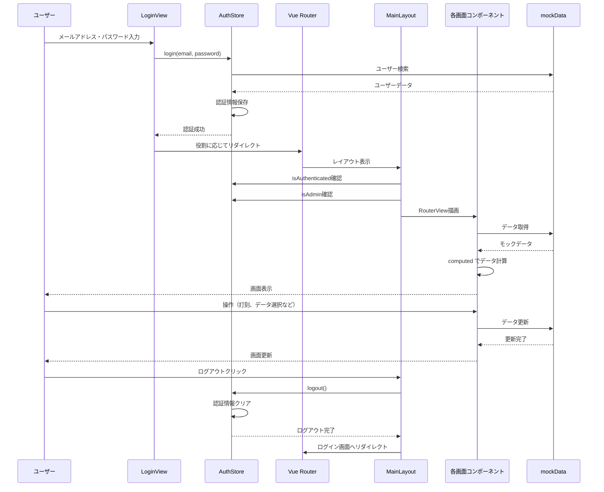

# コンポーネントツリー

## 1. 全体構造

```
App.vue
├── MainLayout.vue (条件付き)
│   ├── v-app-bar (メインヘッダー)
│   │   ├── v-app-bar-nav-icon (管理者のみ)
│   │   ├── v-app-bar-title
│   │   ├── v-chip (ユーザー情報)
│   │   └── v-btn (ログアウトボタン)
│   │
│   ├── v-app-bar (タブナビゲーション - 一般従業員のみ)
│   │   └── v-tabs
│   │       └── v-tab × 2
│   │
│   ├── v-navigation-drawer (サイドバー - 管理者のみ)
│   │   └── v-list
│   │       └── v-list-item × 4
│   │
│   └── v-main
│       └── RouterView (各画面コンポーネント)
│
└── RouterView (レイアウトなしの画面)
```

## 2. 画面別コンポーネントツリー

### 2.1 ログイン画面 (LoginView.vue)

**パス:** `/login`
**レイアウト:** なし



**主要な状態:**
- `email: ref<string>('')`
- `password: ref<string>('')`

**主要なメソッド:**
- `login()` - ログイン処理
- `fillAdminAccount()` - 管理者アカウント自動入力
- `fillEmployeeAccount()` - 一般従業員アカウント自動入力

---

### 2.2 打刻画面 (HomeView.vue)

**パス:** `/`
**権限:** 一般従業員
**レイアウト:** タブナビゲーション



**主要な状態:**
- `currentTime: ref<Date>(new Date())`
- `todayAttendance: computed<Attendance | undefined>()`

**主要なメソッド:**
- `handleCheckIn()` - 出勤処理
- `handleCheckOut()` - 退勤処理
- `getCurrentPosition()` - 位置情報取得

---

### 2.3 勤怠一覧画面 (AttendanceListView.vue)

**パス:** `/attendance`
**権限:** 一般従業員・管理者
**レイアウト:** タブナビゲーション (一般) / サイドバー (管理者)



**主要な状態:**
- `selectedDate: ref<string>(today)`
- `employeeAttendanceList: computed<AttendanceListItem[]>()`

**主要なメソッド:**
- `formatTime(date)` - 時刻フォーマット
- `getStatusText(status)` - ステータステキスト取得
- `getStatusColor(status)` - ステータス色取得

---

### 2.4 管理者ダッシュボード (DashboardView.vue)

**パス:** `/admin/dashboard`
**権限:** 管理者
**レイアウト:** サイドバー



**主要な状態:**
- `summary: computed<SummaryData>()`
- `chartData: ChartData` (mockChartData)
- `attendanceRateOptions: ApexChartOptions`
- `avgWorkHoursOptions: ApexChartOptions`
- `lateEarlyLeaveOptions: ApexChartOptions`
- `departmentStatusOptions: ApexChartOptions`

---

### 2.5 従業員管理画面 (EmployeeListView.vue)

**パス:** `/admin/employees`
**権限:** 管理者
**レイアウト:** サイドバー



**主要な状態:**
- `selectedMonth: ref<string>(currentYearMonth)`
- `employeeList: computed<EmployeeListItem[]>()`

---

### 2.6 チーム勤怠管理画面 (TeamView.vue)

**パス:** `/admin/team`
**権限:** 管理者
**レイアウト:** サイドバー



**主要な状態:**
- `selectedDate: ref<string>(today)`
- `selectedManagerId: ref<string | null>(null)`
- `managers: computed<ManagerOption[]>()`
- `selectedManagerName: computed<string>()`
- `teamAttendanceList: computed<TeamAttendanceItem[]>()`
- `teamSummary: computed<TeamSummary>()`

**主要なメソッド:**
- `formatTime(date)` - 時刻フォーマット
- `getStatusText(status)` - ステータステキスト取得
- `getStatusColor(status)` - ステータス色取得

---

### 2.7 共通レイアウト (MainLayout.vue)

**使用箇所:** 全画面（ログイン画面以外）



**Props:**
- `showHeader?: boolean` (default: true)
- `showSidebar?: boolean` (default: false)
- `showFooter?: boolean` (default: false)
- `showTabs?: boolean` (default: false)

**主要な状態:**
- `drawer: ref<boolean>(true)` - サイドバー開閉状態
- `snackbar: ref<boolean>(false)` - スナックバー表示状態
- `snackbarMessage: ref<string>('')` - スナックバーメッセージ
- `snackbarColor: ref<string>('success')` - スナックバー色
- `currentTab: ref<string | null>(null)` - 現在のタブ

**Computed:**
- `currentYear` - 現在の年
- `tabs` - タブ定義（役割に応じて変更）
- `menuItems` - サイドバーメニュー項目

**主要なメソッド:**
- `handleLogout()` - ログアウト処理
- `isActive(path)` - アクティブメニュー判定

---

## 3. コンポーネント依存関係



## 4. 主要コンポーネントの責務

### 4.1 App.vue
- アプリケーション全体のルートコンポーネント
- レイアウト設定の決定（役割・認証状態に応じて）
- MainLayout または RouterView の条件付きレンダリング

### 4.2 MainLayout.vue
- 共通レイアウトコンポーネント
- ヘッダー、サイドバー、タブナビゲーションの表示制御
- ログアウト処理
- スナックバー表示

### 4.3 LoginView.vue
- ログイン画面
- 認証処理
- モックアカウント自動入力
- 役割に応じたリダイレクト

### 4.4 HomeView.vue
- 打刻画面（一般従業員用）
- リアルタイム時計表示
- 出勤・退勤処理
- 位置情報取得
- 本日の勤怠状態表示

### 4.5 AttendanceListView.vue
- 勤怠一覧画面（一般従業員・管理者共通）
- 日付選択
- 全従業員の勤怠データ表示
- ステータス別色分け表示

### 4.6 DashboardView.vue
- 管理者ダッシュボード
- サマリーデータ表示（4つのカード）
- グラフ表示（4つのグラフ）
- データ集計・計算

### 4.7 EmployeeListView.vue
- 従業員管理画面（管理者用）
- 月選択
- 従業員一覧表示
- 月次勤怠集計

### 4.8 TeamView.vue
- チーム勤怠管理画面（管理者用）
- 主任選択（v-select）
- 日付選択
- チームサマリー表示
- チームメンバー勤怠一覧表示

## 5. コンポーネント間のデータフロー



## 6. Vuetify コンポーネント使用状況

| コンポーネント | 使用画面 | 用途 |
|-------------|---------|------|
| v-app | MainLayout | アプリケーションラッパー |
| v-app-bar | MainLayout | ヘッダー、タブナビゲーション |
| v-navigation-drawer | MainLayout | サイドバー（管理者用） |
| v-container | 全画面 | コンテナ |
| v-row / v-col | 全画面 | グリッドレイアウト |
| v-card | 全画面 | カードコンテナ |
| v-btn | 全画面 | ボタン |
| v-text-field | LoginView, AttendanceListView, EmployeeListView, TeamView | テキスト入力、日付・月選択 |
| v-select | TeamView | 主任選択プルダウン |
| v-data-table | AttendanceListView, EmployeeListView, TeamView | データテーブル |
| v-chip | MainLayout, AttendanceListView, EmployeeListView, TeamView | ステータス表示、ユーザー情報 |
| v-icon | 全画面 | アイコン表示 |
| v-tabs / v-tab | MainLayout | タブナビゲーション |
| v-list / v-list-item | MainLayout | サイドバーメニュー |
| v-snackbar | MainLayout | 通知メッセージ |
| apexchart | DashboardView | グラフ表示 |

## 7. 再利用可能なコンポーネント候補（将来の拡張）

現在は全て単一ファイルコンポーネントですが、以下のような共通コンポーネントを抽出できます：

1. **StatusChip.vue** - ステータス表示用チップ
   - 使用箇所: AttendanceListView, EmployeeListView, TeamView
   - Props: `status: AttendanceStatus`

2. **DatePicker.vue** - 日付選択コンポーネント
   - 使用箇所: AttendanceListView, TeamView
   - Props: `modelValue: string`, `label: string`

3. **SummaryCard.vue** - サマリーカード
   - 使用箇所: DashboardView, TeamView
   - Props: `icon: string`, `value: number`, `title: string`, `color: string`

4. **AttendanceTable.vue** - 勤怠テーブル
   - 使用箇所: AttendanceListView, TeamView
   - Props: `items: AttendanceItem[]`, `headers: DataTableHeader[]`

5. **MonthPicker.vue** - 月選択コンポーネント
   - 使用箇所: EmployeeListView
   - Props: `modelValue: string`, `label: string`
