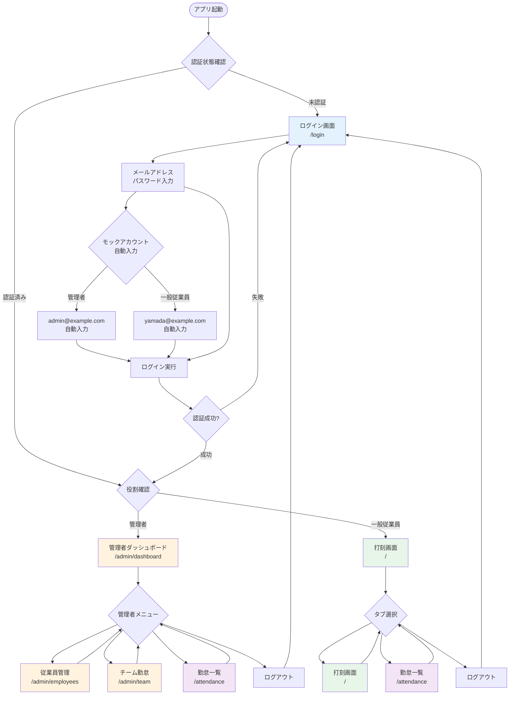
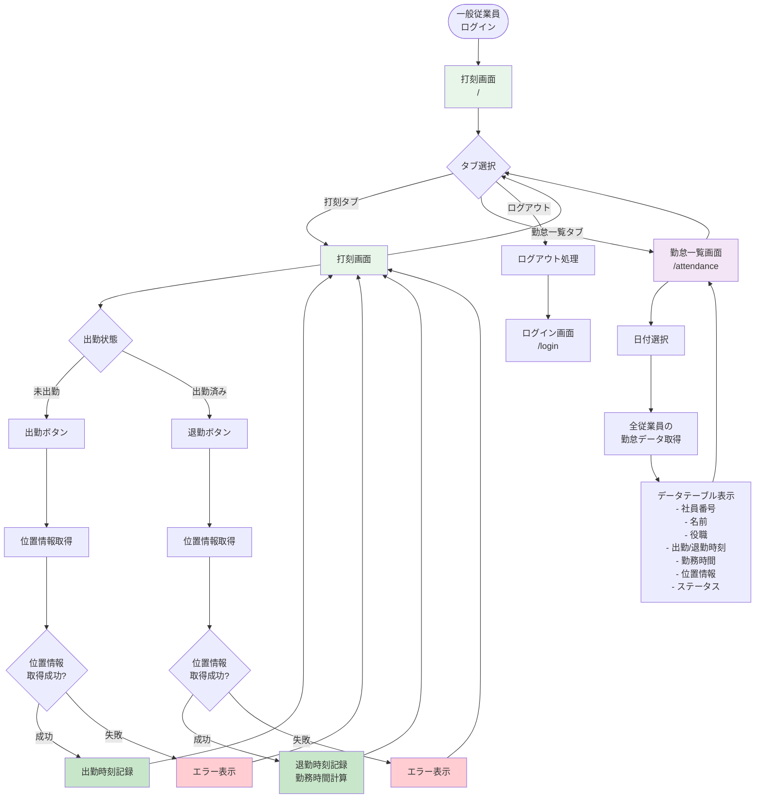
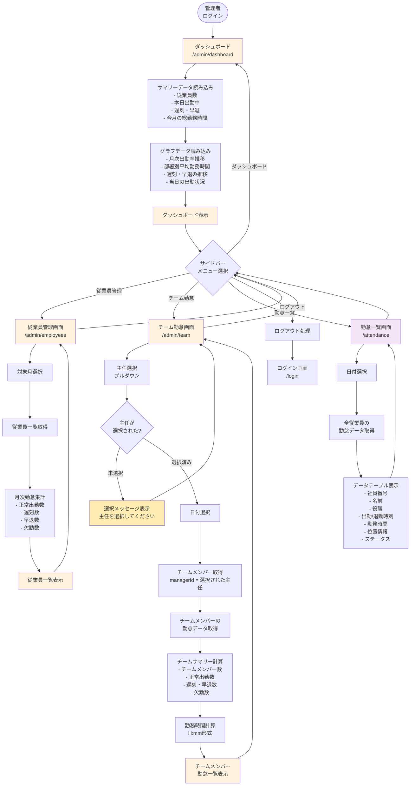
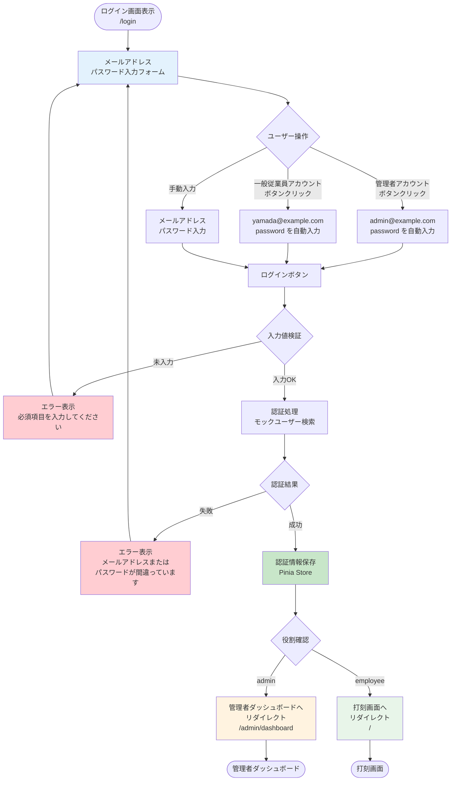
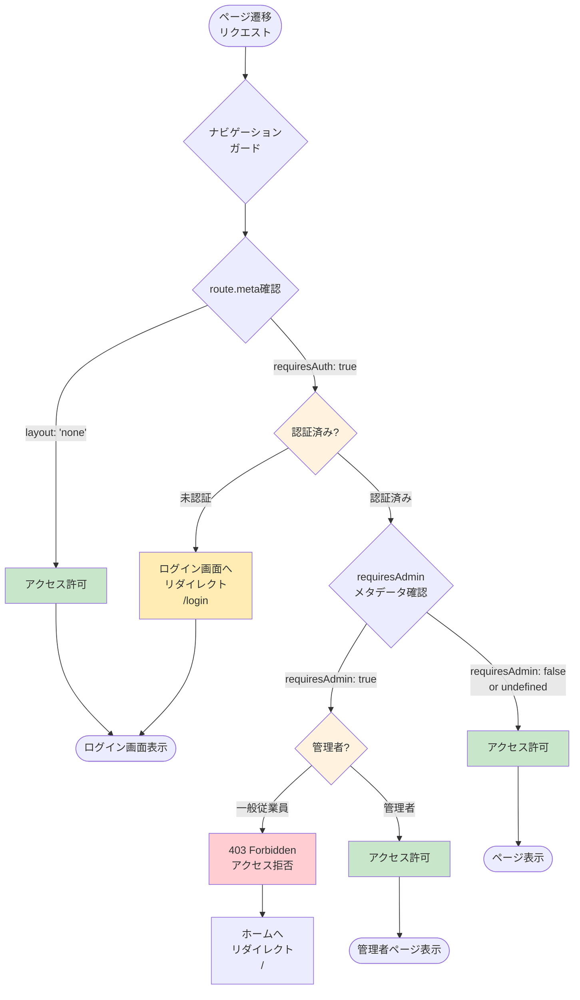
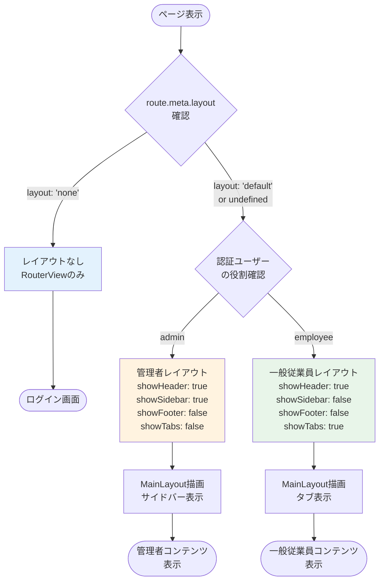
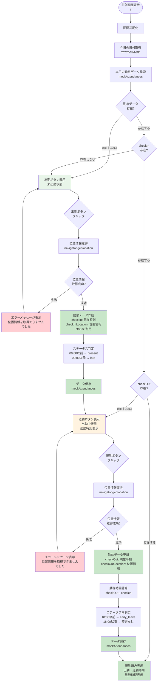
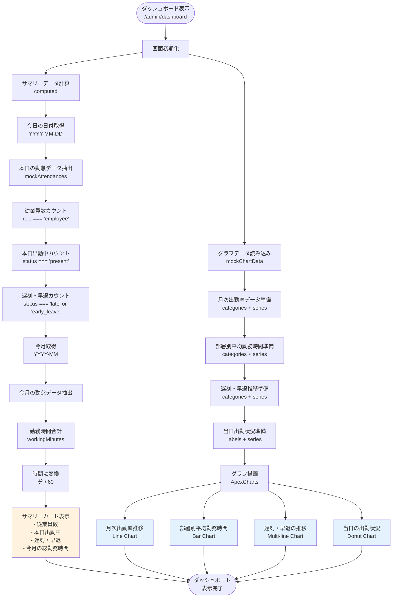

# 画面遷移フローチャート

## 1. 全体フロー (役割別)

## 2. 一般従業員の画面遷移詳細

## 3. 管理者の画面遷移詳細

## 4. ログイン処理フロー詳細

## 5. ルートガード処理フロー

## 6. レイアウト切り替えフロー

## 7. 主要画面の内部フロー

### 7.1 打刻画面 (HomeView) の内部フロー

### 7.2 ダッシュボード (DashboardView) のデータ読み込みフロー

### 7.3 チーム勤怠 (TeamView) のデータ読み込みフロー

```mermaid
flowchart TD
    Start([チーム勤怠画面表示<br/>/admin/team]) --> InitView[画面初期化]

    InitView --> LoadManagers[主任リスト取得<br/>computed]
    LoadManagers --> FilterManagers[主任をフィルタ<br/>position === '主任'<br/>role === 'employee']
    FilterManagers --> MapManagers[主任データ変換<br/>id, name, label<br/>department, employeeNumber]
    MapManagers --> DisplayManagerSelect[主任選択プルダウン表示<br/>v-select]

    DisplayManagerSelect --> ManagerAction{主任選択}
    ManagerAction -->|未選択| ShowEmptyMessage[空メッセージ表示<br/>主任を選択してください]

    ManagerAction -->|選択| GetSelectedManager[selectedManagerId設定]
    GetSelectedManager --> GetSelectedDate[selectedDate取得<br/>デフォルト: 今日]
    GetSelectedDate --> LoadTeamMembers[チームメンバー取得<br/>computed]

    LoadTeamMembers --> FilterTeamMembers[チームメンバーフィルタ<br/>managerId === selectedManagerId<br/>role === 'employee']
    FilterTeamMembers --> MapTeamMembers[メンバーごとに処理<br/>map]

    MapTeamMembers --> FindAttendance[勤怠データ検索<br/>userId + date]
    FindAttendance --> AttendanceExists{勤怠データ<br/>存在?}

    AttendanceExists -->|存在しない| SetAbsent[status = 'absent'<br/>その他 = null or '-']
    AttendanceExists -->|存在する| GetCheckIn[checkIn取得]
    GetCheckIn --> GetCheckOut[checkOut取得]
    GetCheckOut --> CalcWorkingHours[勤務時間計算<br/>workingMinutes → H:mm]
    CalcWorkingHours --> GetStatus[status取得]
    GetStatus --> GetNote[note取得]

    SetAbsent --> BuildRecord[レコード構築<br/>employeeNumber, name<br/>position, checkIn<br/>checkOut, workingHours<br/>status, note]
    GetNote --> BuildRecord

    BuildRecord --> NextMember{次のメンバー?}
    NextMember -->|あり| FindAttendance
    NextMember -->|なし| CalcTeamSummary[チームサマリー計算<br/>computed]

    CalcTeamSummary --> CountTotal[チームメンバー数]
    CountTotal --> CountPresent[正常出勤数<br/>status === 'present']
    CountPresent --> CountLateEarly[遅刻・早退数<br/>status === 'late' or 'early_leave']
    CountLateEarly --> CountAbsent[欠勤数<br/>status === 'absent']
    CountAbsent --> DisplaySummary[サマリーカード表示<br/>- チームメンバー数<br/>- 正常出勤<br/>- 遅刻・早退<br/>- 欠勤]

    DisplaySummary --> DisplayTable[データテーブル表示<br/>v-data-table<br/>チームメンバー勤怠一覧]
    DisplayTable --> Complete([画面表示完了])
    ShowEmptyMessage --> Complete

    style DisplayManagerSelect fill:#fff3e0
    style ShowEmptyMessage fill:#ffecb3
    style DisplaySummary fill:#c8e6c9
    style DisplayTable fill:#e8f5e9
```

## 凡例

- **青色 (fill:#e3f2fd)**: ログイン関連
- **緑色 (fill:#e8f5e9)**: 一般従業員関連
- **オレンジ色 (fill:#fff3e0)**: 管理者関連
- **紫色 (fill:#f3e5f5)**: 共通画面（勤怠一覧）
- **濃緑色 (fill:#c8e6c9)**: 成功・完了処理
- **赤色 (fill:#ffcdd2)**: エラー処理
- **黄色 (fill:#ffecb3)**: 警告・空状態
